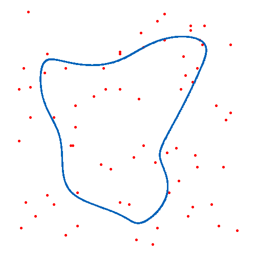

# 使用自组织映射(SOM)解决旅行商问题

## 作者: 李志
### EMAIL:  201782016@mail.dlut.edu.cn

## 1. 简介

该存储库包含自组织映射 (Self-Organizing Maps) 的实现，
该映射可用于查找旅行商问题的次优解决方案。
程序支持的问题的实例是 **.tsp** 文件，这是此问题中的一种普遍格式,
相关 **.tsp** 文件可以在 **assets** 目录中找到,
网络构建的代码都可以在 **library** 目录中找到,
训练结果可以在 **data** 目录中找到,
报告可以在 **report** 文件夹中找到。

## 2. 算法演示



## 3. 使用说明

要运行代码，只需要Python 3和依赖项（默认情况下包含在Anaconda发行版中的 **matplotlib**，**numpy** 和 **pandas**）。如果您不使用Anaconda，则可以使用以下命令安装所有依赖项：

```bash
pip install -r requirements.txt
```

要运行代码，只需执行以下命令：

```bash
cd som-tsp 
python main.py assets/<instance>.tsp
```

som网络训练过程可视化，可查看图片 **data/som.png**，
算法最终生成的路径将存储在 **data/routes** 文件夹中。

如果您有任何疑问，请随时与我联系或通过创建问题来为此存储库做出贡献。

-----

该代码是用于本人现代智能优化算法课设，
部分代码借鉴[此存储库](https://github.com/DiegoVicen/som-tsp)

